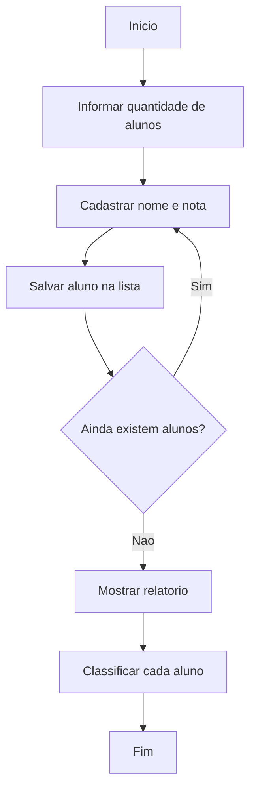

# Analisador de Notas da Turma


Projeto desenvolvido durante meus estudos de fundamentos em Python.  
O objetivo do programa e cadastrar alunos, armazenar suas notas e gerar um relatorio final com a situacao de cada estudante.

## Preview

```text
Quantos alunos tem na turma? 3

Nome do aluno 1: Ana
Nota do aluno Ana: 8.5

Nome do aluno 2: Joao
Nota do aluno Joao: 6.0

Nome do aluno 3: Maria
Nota do aluno Maria: 4.5

===== RELATORIO =====
Ana - 8.5 - Aprovado
Joao - 6.1 - Recuperacao
Maria - 4.5 - Reprovado
```

## Sobre o Projeto

O **Analisador de Notas da Turma** e um programa simples executado no terminal.
Ele recebe a quantidade de alunos, cadastra o nome e a nota de cada um, guarda essas informacoes em uma lista de tuplas e exibe um relatorio com a situacao final.

Esse projeto foi criado para praticar conceitos essenciais da linguagem Python antes de avancar para assuntos como funcoes, arquivos, orientacao a objetos e bibliotecas externas.

## Funcionalidades

- Cadastrar a quantidade de alunos da turma.
- Receber o nome de cada aluno.
- Receber a nota de cada aluno.
- Armazenar os dados em uma lista.
- Usar tuplas para representar cada aluno.
- Exibir um relatorio final.
- Classificar alunos como:
  - Aprovado
  - Recuperacao
  - Reprovado

## Regras de Classificacao

| Nota do aluno | Situacao |
| --- | --- |
| Maior ou igual a 7 | Aprovado |
| Maior ou igual a 5 e menor que 7 | Recuperacao |
| Menor que 5 | Reprovado |

## Conceitos de Python Praticados

Este projeto utiliza varios fundamentos importantes da linguagem Python:

| Conceito | Como foi usado |
| --- | --- |
| `input()` | Para receber dados digitados pelo usuario |
| `int` | Para guardar a quantidade de alunos |
| `float` | Para guardar as notas |
| `str` | Para guardar os nomes dos alunos |
| `list` | Para guardar todos os alunos cadastrados |
| `tuple` | Para guardar nome e nota de cada aluno |
| `while` | Para repetir o cadastro enquanto houver alunos |
| `for` | Para percorrer a lista de alunos no relatorio |
| `if`, `elif`, `else` | Para verificar a situacao de cada aluno |
| Operadores relacionais | Para comparar as notas |
| Operadores logicos | Para montar condicoes mais completas |

## Fluxo do Programa



## Estrutura dos Dados

Cada aluno e guardado em uma tupla com duas informacoes:

```python
(nome_aluno, nota_aluno)
```

Todas as tuplas sao guardadas dentro de uma lista:

```python
alunos = [
    ("Ana", 8.5),
    ("Joao", 6.0),
    ("Maria", 4.5)
]
```

Essa estrutura ajuda a praticar listas e tuplas de forma simples e organizada.

## Como Executar

1. Tenha o Python instalado na maquina.
2. Clone este repositorio:

```bash
git clone https://github.com/seu-usuario/seu-repositorio.git
```

3. Entre na pasta do projeto:

```bash
cd seu-repositorio
```

4. Execute o arquivo principal:

```bash
python main.py
```

> Caso o arquivo tenha outro nome, substitua `main.py` pelo nome correto.

## Exemplo de Codigo Principal

O projeto usa uma lista para armazenar os alunos:

```python
alunos = []
```

Cada aluno cadastrado e salvo como uma tupla:

```python
tupla = (nome_aluno, nota_aluno)
alunos.append(tupla)
```

Depois, o programa percorre a lista para gerar o relatorio:

```python
for aluno in alunos:
    nome, nota = aluno
```

## Melhorias Futuras

Algumas melhorias que podem ser adicionadas conforme o aprendizado avancar:

- Validar notas menores que 0 ou maiores que 10.
- Calcular a media geral da turma.
- Mostrar a maior e a menor nota.
- Contar quantos alunos foram aprovados, ficaram de recuperacao ou foram reprovados.
- Separar o codigo em funcoes.
- Salvar os dados em um arquivo.
- Criar uma versao com menu interativo.

## Aprendizados

Com este projeto, foi possivel praticar a base da programacao em Python:

- Como receber dados do usuario.
- Como repetir comandos com lacos.
- Como armazenar varios dados em listas.
- Como usar tuplas para agrupar informacoes.
- Como tomar decisoes com condicionais.
- Como percorrer dados com `for`.
- Como montar um pequeno programa com entrada, processamento e saida.

## Autor

Desenvolvido por **Ruan** como parte dos estudos em Python.

---

Este projeto representa uma etapa inicial da jornada em programacao, focada em construir uma base solida antes de avancar para projetos maiores.
