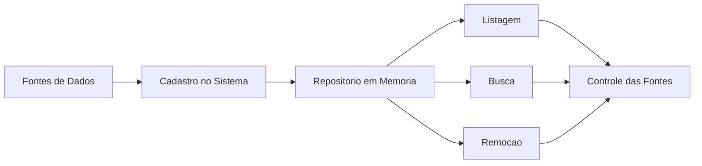
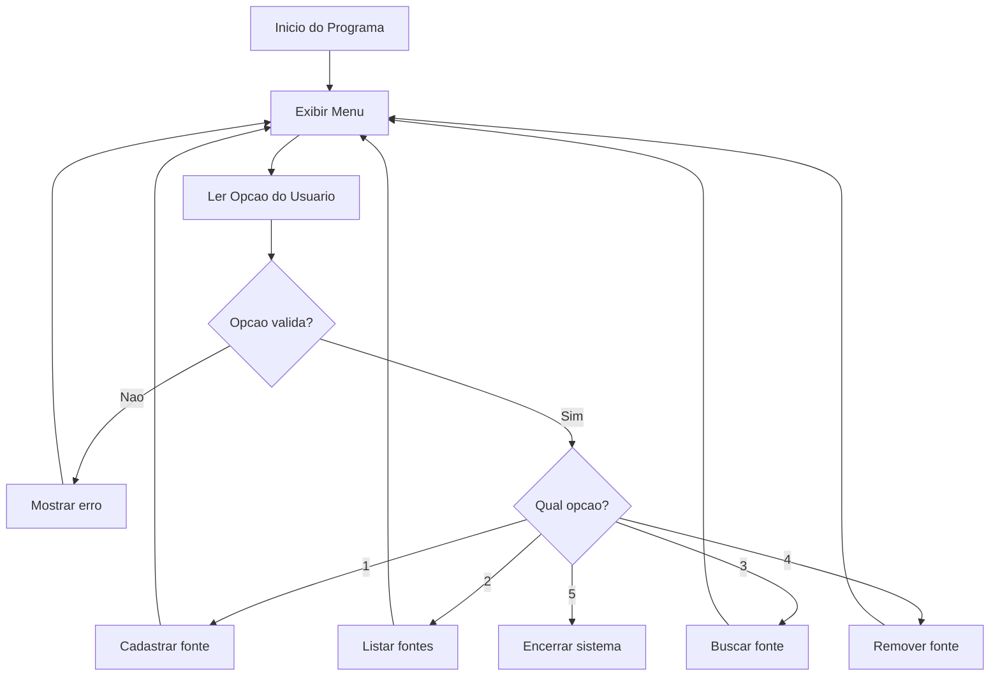
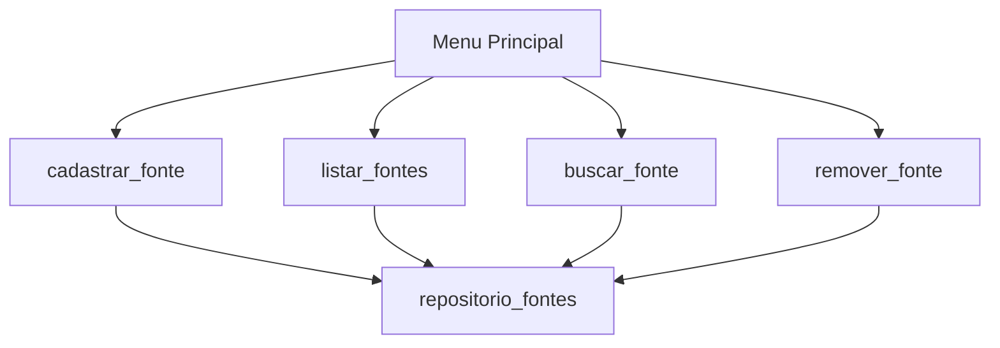

# Cadastro de Fontes de Dados

<p align="center">
  <strong>Mini projeto em Python para praticar listas, funcoes, repositorio em memoria e tratamento de excecoes.</strong>
</p>

<p align="center">
  
  
  
</p>

---

## Visao Geral

O **Cadastro de Fontes de Dados** e um sistema simples executado no terminal que simula uma rotina comum em projetos de dados: registrar, consultar, listar e remover fontes de dados utilizadas por uma empresa.

Mesmo sendo um mini projeto, ele trabalha conceitos importantes para quem esta iniciando em **engenharia de dados**, como organizacao de dados em uma estrutura de armazenamento, separacao de responsabilidades com funcoes e validacao de entradas do usuario.

Exemplos de fontes que podem ser cadastradas:

- Banco PostgreSQL
- Planilha Excel
- API de Vendas
- Arquivo CSV
- Data Lake
- Bucket S3

---

## Intencao Do Projeto

Este projeto foi criado para transformar conceitos basicos de Python em uma aplicacao pequena, mas com comportamento parecido com sistemas reais.

Em engenharia de dados, e comum trabalhar com varias fontes diferentes: bancos relacionais, arquivos, APIs, planilhas, filas e sistemas externos. Antes de processar dados, muitas vezes e necessario **registrar, controlar e validar quais fontes existem**.



---

## Objetivos De Aprendizado

Ao construir este projeto, voce pratica:

- Criacao e manipulacao de listas
- Uso de funcoes para organizar responsabilidades
- Uso de uma lista como repositorio em memoria
- Estrutura de menu com `while True`
- Validacao de entrada do usuario
- Tratamento de excecoes com `try` e `except`
- Controle de fluxo com `if`, `elif` e `else`
- Uso de `if __name__ == '__main__':`

---

## Funcionalidades

O sistema deve permitir que o usuario:

| Opcao | Funcionalidade | Descricao |
|---:|---|---|
| 1 | Cadastrar fonte | Adiciona uma nova fonte de dados ao repositorio |
| 2 | Listar fontes | Exibe todas as fontes cadastradas |
| 3 | Buscar fonte | Verifica se uma fonte existe no repositorio |
| 4 | Remover fonte | Remove uma fonte cadastrada |
| 5 | Sair | Encerra o sistema |

---

## Fluxo Do Programa



---

## Arquitetura Simples

O projeto pode ser organizado em pequenas funcoes. Cada funcao tem uma responsabilidade clara.



---

## Regras De Negocio

O sistema deve respeitar as seguintes regras:

- Nao cadastrar fonte com nome vazio
- Nao remover uma fonte que nao existe
- Informar quando uma busca nao encontrar resultado
- Informar quando nao houver fontes cadastradas
- Tratar erro quando o usuario digitar texto no lugar da opcao numerica
- Manter o programa rodando ate o usuario escolher sair

---

## Exemplo De Uso No Terminal

```text
===== CADASTRO DE FONTES DE DADOS =====
1 - Cadastrar fonte
2 - Listar fontes
3 - Buscar fonte
4 - Remover fonte
5 - Sair

Digite uma opcao: 1
Digite o nome da fonte de dados: Banco PostgreSQL
Fonte cadastrada com sucesso.

===== CADASTRO DE FONTES DE DADOS =====
1 - Cadastrar fonte
2 - Listar fontes
3 - Buscar fonte
4 - Remover fonte
5 - Sair

Digite uma opcao: 1
Digite o nome da fonte de dados: API de Vendas
Fonte cadastrada com sucesso.

===== CADASTRO DE FONTES DE DADOS =====
1 - Cadastrar fonte
2 - Listar fontes
3 - Buscar fonte
4 - Remover fonte
5 - Sair

Digite uma opcao: 2
Fontes cadastradas:
- Banco PostgreSQL
- API de Vendas
```

---

## Exemplo De Tratamento De Erro

```text
===== CADASTRO DE FONTES DE DADOS =====
1 - Cadastrar fonte
2 - Listar fontes
3 - Buscar fonte
4 - Remover fonte
5 - Sair

Digite uma opcao: abc
Opcao invalida. Digite apenas numeros.
```

```text
Digite o nome da fonte de dados:
Nome da fonte nao pode ser vazio.
```

```text
Digite o nome da fonte que deseja remover: Oracle
Fonte nao encontrada. Nao foi possivel remover.
```

---

## Conceitos De Engenharia De Dados

Embora seja um projeto inicial, ele representa ideias presentes em sistemas maiores:

| Conceito no Projeto | Relacao com Engenharia de Dados |
|---|---|
| Fonte de dados | Origem de informacoes usadas em pipelines |
| Repositorio em lista | Estrutura simples para armazenar metadados |
| Cadastro | Registro de fontes disponiveis |
| Busca | Consulta de metadados |
| Remocao | Controle de fontes desativadas ou processadas |
| Validacao | Garantia minima de qualidade da entrada |

---

## Possivel Evolucao

Depois que a primeira versao estiver funcionando, o projeto pode evoluir para:

- Salvar as fontes em arquivo `.txt`
- Salvar os dados em arquivo `.csv`
- Usar dicionarios para guardar mais informacoes
- Adicionar tipo da fonte, como `Banco`, `API`, `CSV` ou `Excel`
- Adicionar status, como `Ativa` ou `Inativa`
- Integrar com banco de dados
- Criar logs das operacoes realizadas

---

## Checklist Do Projeto

- [ ] Criar lista para armazenar as fontes
- [ ] Criar menu principal
- [ ] Criar funcao para cadastrar fonte
- [ ] Criar funcao para listar fontes
- [ ] Criar funcao para buscar fonte
- [ ] Criar funcao para remover fonte
- [ ] Tratar opcao invalida
- [ ] Validar fonte vazia
- [ ] Usar `if __name__ == '__main__':`
- [ ] Testar o fluxo completo no terminal

---

## Estrutura Sugerida

```text
cadastro-fontes-dados/
|
|-- main.py
|-- README.md
```

---

## Como Executar

No terminal, execute:

```bash
python main.py
```

---

## Autor

Projeto desenvolvido como parte dos estudos de Python com foco em fundamentos para engenharia de dados.

---

<p align="center">
  <strong>Um pequeno projeto, mas com mentalidade de sistema real.</strong>
</p>
